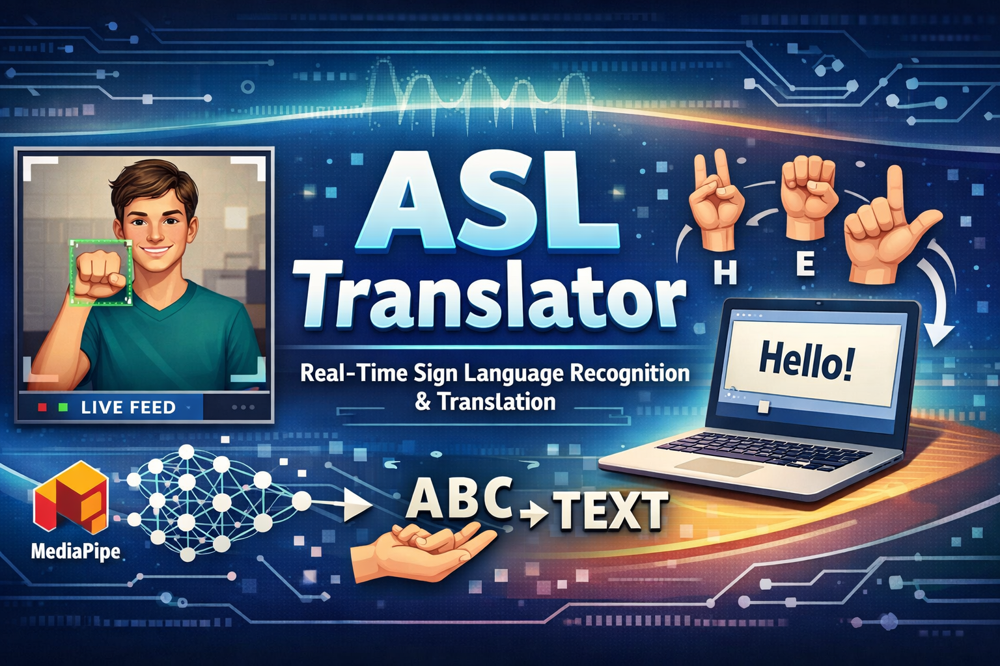

<p align="center">
  
</p>

# 🤟 ASL Translator – Real-Time Sign Language Recognition

An end-to-end **American Sign Language (ASL) recognition system** built using **MediaPipe landmark detection** and **Deep Learning (LSTM)**.  
This project covers the full pipeline: **data collection → model training → real-time inference** using a webcam.

---

## 📌 Project Overview

This project translates **ASL hand gestures into text** by extracting human landmarks instead of raw images, making the system faster, lightweight, and robust to lighting conditions.

### Currently Supported Signs
- `hello`
- `thanks`
- `iloveyou`
  
---

## 🧠 How It Works

1. Webcam captures live video frames  
2. MediaPipe extracts **pose, face, and hand landmarks**  
3. Each frame is converted into **1662 numerical features**  
4. A sequence of 30 frames is fed to an **LSTM neural network**  
5. The model predicts the corresponding ASL gesture in real time  

---

## 📁 Project Structure

```
ASL-translator/
│
├── app.py                       # Flask + Socket.IO web server (web app entry point)
├── collect_data.py              # Collect landmark data using webcam
├── train_model.py               # Train LSTM model
├── realtime_test.py             # Real-time ASL prediction (desktop)
├── utils.py                     # MediaPipe detection & keypoint extraction
│
├── templates/
│   └── index.html               # Web frontend (webcam + Canvas overlay + UI)
│
├── requirements.txt             # Project dependencies
│
├── hand_landmarker.task         # MediaPipe hand model
├── face_landmarker.task         # MediaPipe face model
├── pose_landmarker_lite.task    # MediaPipe pose model
│
├── MP_Data/                     # Auto-generated dataset directory
└── README.md
```

---

## ✨ Key Features

- Multi-modal landmark extraction (Face + Pose + Both Hands)
- Automatic dataset generation
- LSTM-based temporal gesture learning
- **Web-based real-time inference** — runs in any browser, no local OpenCV window required
- Landmark overlay drawn on HTML5 Canvas (pose skeleton, hand skeleton, face dots)
- Confidence panel, live sentence history, and sign badge
- Easy to extend with new gestures

---

## 🛠️ Tech Stack

- Python 3
- OpenCV
- MediaPipe Tasks
- NumPy
- TensorFlow / Keras
- Scikit-learn
- Flask + Flask-SocketIO (web server)
- HTML5 Canvas + Socket.IO (frontend)

---

## 📦 Installation

### 1️⃣ Clone the Repository
```bash
git clone https://github.com/ArnavPundir22/ASL-translator.git
cd ASL-translator
```

### 2️⃣ Install Dependencies
```bash
pip install -r requirements.txt
```

---

## ▶️ Usage

### Step 1: Collect Training Data
```bash
python collect_data.py
```
- Records 30 sequences per gesture  
- Each sequence contains 30 frames  
- Saves landmark data in `MP_Data/`

---

### Step 2: Train the Model
```bash
python train_model.py
```
- Trains an LSTM-based classifier  
- Saves the trained model as `action.h5`

---

### Step 3: Run the Web App
```bash
python app.py
```
- Opens a browser-based interface at **http://localhost:5000**
- Click **▶ Start Camera** and allow webcam access
- Perform ASL signs — predictions appear in real time
- Press **Clear** to reset the sentence

> **Note:** The Flask server must be running while you use the browser interface. The model inference and MediaPipe processing happen server-side; only JPEG frames and JSON results are sent over the local network.

---

### Step 3 (alternative): Desktop-only Mode
```bash
python realtime_test.py
```
- Displays predicted gestures live in an OpenCV window  
- Press **`q`** to exit  

---

## 🧬 Landmark Feature Breakdown

Each frame contains **1662 features**:

| Component | Features |
|---------|----------|
| Pose (33 × 4) | 132 |
| Face (468 × 3) | 1404 |
| Left Hand (21 × 3) | 63 |
| Right Hand (21 × 3) | 63 |
| **Total** | **1662** |

---

## 🧪 Model Architecture

```
Input: (30, 1662)

LSTM (64)
↓
LSTM (128)
↓
LSTM (64)
↓
Dense (64)
↓
Dense (32)
↓
Softmax Output
```

---

## 🚀 Future Improvements

- Add more ASL gestures
- Sentence-level translation
- Text-to-speech output
- Transformer-based sequence models
- Deploy to a cloud server for remote access

---

## ⚠️ Notes

- Use consistent gestures during data collection
- Ensure good lighting
- Collect balanced samples for each class

---

## 👨‍💻 Author

**Arnav Pundir**  
Computer Vision & AI Developer  
GitHub: https://github.com/ArnavPundir22

---

⭐ If you found this project useful, don’t forget to star the repository!
